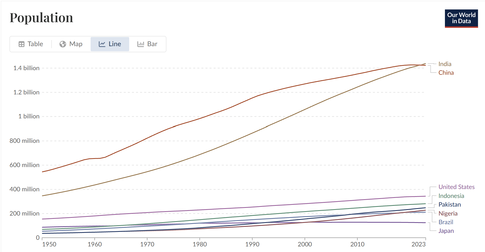
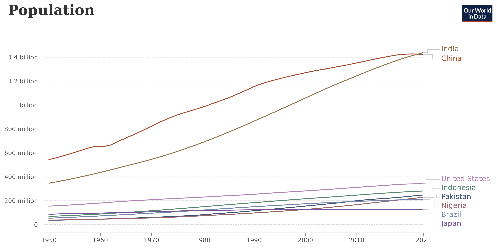
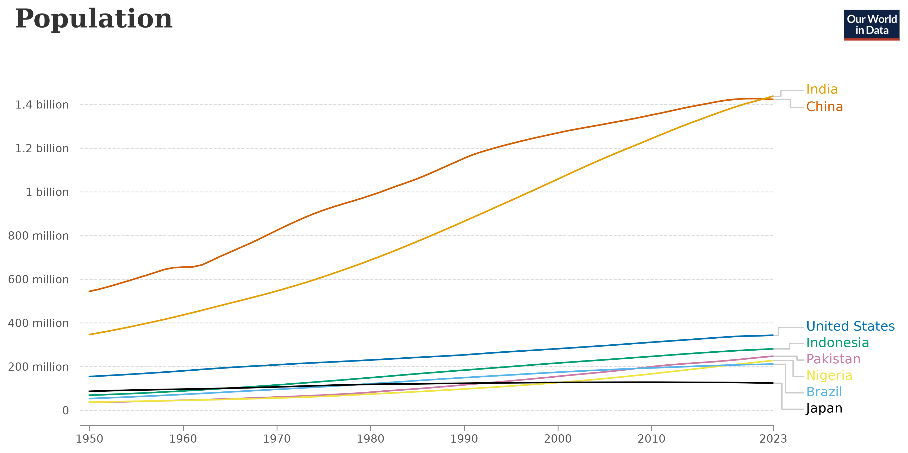

# Bundle 1

### Table of Contents
* [Bundle 1](#bundle-1)
  * [Go to Part I: Steps vs. Average Air Temperature](#part-i-steps-vs-average-air-temperature)
  * [Go to Part II: Web Data Visualisation Analysis (PT Bank Central Asia Tbk)](#part-ii-web-data-visualisation-analysis-pt-bank-central-asia-tbk)
* [Bundle 2](#bundle-2)
  * [Go to Part III: Data Verification Audit (HowMuch.net)](#part-iii-data-verification-audit-howmuchnet-280826)
  * [Go to Part IV: Tools of the Trade (Technical Skills & Certification)](#part-iv-tools-of-the-trade-technical-skills--certification)
  * [Go to Part V: Data Visualisation Reproduction & Reconstruction (Our World in Data) (28/08/26)](#part-v-data-visualisation-reproduction--reconstruction-our-world-in-data-280826)

---

## Part I: Steps vs. Average Air Temperature

### Data Visualization

*Figure 1*  
*Graph Showing Steps Against Average Air Temperature*

---
##### Note: Due to my mistake, I forgot to document the stages of creating the data visualization, but I can assure you that this was all done by my hands 
### Project Overview

What I made here is a chart featuring multiple variables such as steps, average air temperature, active calories burned, and distance while active. I gathered the data from my Samsung Health app which tracked down the health metrics that I plotted down in the graph. For the average air temperature I took the lowest and the Highest temperatures from a dataset from the Australian Bureau of Meteorology’s website, and found the average using that (Bureau of Meteorology, 2026). I tried incorporating multiple different variables into the graph and Figure 1 is what I ended up with. The main thing I wanted to show was the correlation between the average air temperature and the amount of steps I was taking. The second thing I wanted to show was the amount of active calories burned in a day, since I was limited to only two dimensions, I had to get creative and show it using a distinct color scale. Lastly, I tried showing the distance while active through size, but I did not really execute it really well since size scaling is really hard to do accurately using a pencil and paper. Another thing I could have added in was the metric of whether it was a weekday or not by changing the shapes since I have the dates of each points, but I felt like it was a bit too much for me to do. My future goals is to maybe do this digitally and have the correct means to have size scaling and maybe adding more variables.

---

### References

Bureau of Meteorology. (2026). *Melbourne, Victoria daily weather observations* [Data set]. Table 1 Column Temps Min Max. Australian Government. https://www.bom.gov.au/climate/dwo/202607/html/IDCJDW3050.202607.shtml

---

## Part II: Web Data Visualisation Analysis (PT Bank Central Asia Tbk)

### Data Visualization

*Figure 1*  
*PT Bank Central Asia Tbk (BBCA) 6-Month Candlestick Price and Volume Chart (2 Hour Interval)*  
*Note.* Adapted from *PT Bank Central Asia Tbk Stock Price and Chart (IDX:BBCA)*, by TradingView, 2026, TradingView (https://www.tradingview.com/chart/VhRMI5Qy/?symbol=IDX%3ABBCA). Copyright 2026 by TradingView.

---

### Exercise Objective

The main goal of this portfolio exercise is to see and analyze a data visualization on the internet by analyzing its visual design elements and how it is perceived by humans. By paying attention to the features like the preattentive processing, gestalt principles, and visual comparison accuracy, we are able to see how the data visualization grabs our attention and how we read it. 

---

### Analysis Responses

#### 1. Preattentive Processing
The feature that caught my eyes were the sharp dip in the candlestick line at around June and how the colors signify the drop and rise of the stock price. The attributes that help them pop out are the positions of the candlesticks in the Y-axis, the orientation/angle ( the steep downwards and upwards angle), and the color hue (red vs green) (Baglin, 2026). All these attributes work together to grab my attention making it one of the most prominent parts of the chart and showing that there was a significant drop in price by the red line going down, and that there was a correction in price. It tells a story for the audience without needing the audience to read the labels to see that there was something going on there (Baglin, 2026).

#### 2. Gestalt Principles
The data visualization primarily shows the law of continuity as we perceive the 2 hour individual candlesticks as one continuous line (Cherry, 2026). There also some other gestalts law in this chart such as law of proximity allowing us to correlate which candlesticks correlate with which month, law of similarity showing us that candlesticks with the same color means the same thing where green means a rise and red means a drop, and also the law of common region, making it so that we perceive the candlestick chart as it’s own thing, and the two boxes on top as separate things from the chart even if they occupy the same space (Cherry, 2026).

#### 3. Visual Comparison Accuracy
One of the quantitative variable visualised is the stock price, measured in IDR, which is represented by the vertical placement of the candlesticks along the Y-axis. Position along a common scale sit on the top of Cleveland and McGill’s hierarchy of perceptual tasks (Baglin, 2026). Because the price points share the same vertical scale and baseline, the viewers are able to compare the values of the price points with accuracy. However, because this chart spans across 6 months, the y axis has to stretch due to the significant price drops making the Y-axis scale stretches and the candlesticks become thinner, which might make it harder for some viewer to accurately pinpoint the price without zooming in or using the interactive crosshair.

---

### References

Baglin, J. (2026, March 26). *Data visualisation: From theory to practice*. STEM Data Visualisation. https://data-visualisation.stem.melbourne/visual-perception-and-colour.html#preattentive-processing

Cherry, K. (2026, March 2). *What are the Gestalt principles?* Verywell Mind. https://www.verywellmind.com/gestalt-laws-of-perceptual-organization-2795835

TradingView. (2026). *PT Bank Central Asia Tbk stock price and chart* [Financial chart]. Retrieved August 5, 2026, from https://www.tradingview.com/chart/VhRMI5Qy/?symbol=IDX%3ABBCA

---

# Bundle 2

## Part III: Data Verification Audit (HowMuch.net) (28/08/26)

### Data Visualization

*Figure 1*  
*Hexagonal cartogram map of uninsured rates across U.S. states. Adapted from Mapped: Uninsured Rates by State, by HowMuch.net, 2021.*

---

### Exercise Objective

The objective of this exercise is to take a look at a published data visualization and verify if it is correct and appropriate. I have to trace their primary source and analyze the visualization and visual encoding to see if there are any discrepancies and if there is an alignment between the core question and data.

---

### Data Analysis and Verification

#### 1. Types of Variables and Levels of Measurement
* **Geographic entity (U.S. States):** It is represented using hexagons that are laid out in a rough shape of the U.S. where each hexagon border represents geographical boundary. The unit is the state name, and the level of measurement is Nominal.
* **Uninsured Rate (Percentage):** It is represented by numerical labels. The unit is the percentage of uninsured population (%), and level of measurement is Ratio (continuous numeric scale with a true zero).
* **Color Hue & Shading (Choropleth Scale):**  Represented by the fill color of the hexagons. The unit is the visual gradient intensity and the level of measurement is Ordinal.

#### 2. Alignment of Data and Question
* **Data (D):** State level percentages of civilian non-institutionalized residents without insurance from the ACS 1-Year Estimates (U.S. Census Bureau, 2020).
* **Core Question (Q):** How does health insurance coverage vary geographically across the United States, and which states exhibit the highest/lowest rates of uninsured residents?
* **Alignment:** Using the Junk Charts Trifecta Checkup framework (Fung, 2014), there is strong alignment between the core question and the data provided (HowMuch.net, 2021).  Measuring the uninsured percentage by state answers the question of the differences between states.

#### 3. Data Verification
* **Verification Findings:** I placed my data verification results in Comparison.xlsx, and from what I see, all the data visualized from HowMuch.net matches exactly with the data from the official U.S. Census Bureau (2020) ACS Table S2701 dataset exactly. There were no errors found.
* **Confidence:** I am very confident with the data that HowMuch.net (2021) used is accurate, but there is one tiny thing that might mislead the readers. The article and visualization was published in 2021, but the data that HowMuch.net uses is from 2019, so some readers might be mislead and think that they used 2021 data if read carelessly as the article title didn’t say anything about the year.

#### 4. Data Source Examination
-	The primary data source used by HowMuch.net (2021) is highly reputable, as it is published by the U.S. Census Bureau (2020).Even if the data source is reputable, there are also limitations to the data provided. Since the American Community Survey is done using a sample instead of census, each percentage has a margin of error. 

---

### References

Fung, K. (2014, May 26). *Junk Charts Trifecta Checkup: The definitive guide*. Junk Charts. https://www.junkcharts.com/junk-charts-trifecta-checkup-the-definitive-guide/

HowMuch.net. (2021, March 30). *Mapped: Uninsured rates by state*. HowMuch.net. https://howmuch.net/articles/health-insurance-coverage-in-the-us

U.S. Census Bureau. (2020). *Selected characteristics of health insurance coverage in the United States: 2019 American Community Survey 1-year estimates (Table S2701)*. U.S. Department of Commerce. https://data.census.gov/table?q=S2701&g=010XX00US$0400000&y=2019

---

## Part IV: Tools of the Trade (Technical Skills & Certification)

### Exercise Objective

The objective of this section is to show my technical skill set and how proficient I am. It shows where I gained the skills and how I applied it.

---

### Technical Skills & Competency Matrix

| Category | Skill / Tool | Specific Capabilities & Applied Experience | Proficiency Level | Evidence & Application Context |
| :--- | :--- | :--- | :--- | :--- |
| **Data Analytics & ML** | **Python (Prophet, XGBoost, NumPy)** | Time-series sales forecasting, predictive booking models, structured feature analysis, and data preprocessing | Developing | Data Analyst Intern at PT Mandiri Utama Finance; ICISS 2025 Lung Cancer Prediction Research; DataCamp Introduction to Python |
| **Data Visualization** | **Matplotlib & Seaborn** | Custom line charts, time-series plotting, distribution visualisations, subplot structuring, and visual formatting | Developing | ICISS 2025 feature analysis; DataCamp Introduction to Data Visualization with Matplotlib |
| **Business Intelligence** | **Power BI & Microsoft Fabric** | High-traffic executive dashboard optimization, mobile-responsive layouts, custom table-driven tracking, and Fabric storage integration | Developing | Executive dashboards deployed during PT Mandiri Utama Finance internship |
| **Database & Engineering** | **SQL (T-SQL, Oracle SQL)** | Stored procedure optimization, legacy script refactoring, database querying, relational schema mapping | Developing | Data Warehousing & MIS ETL workflows at PT Mandiri Utama Finance |
| **ETL & Orchestration** | **Apache NiFi & Apache Airflow** | Automated ETL pipeline deployment, scheduled workflow orchestration, and enterprise CRM data ingestion | Developing | Data engineering pipeline automation at PT Mandiri Utama Finance |
| **Programming** | **Java & C++** | Object-oriented programming, algorithmic implementation, and fundamental data structure design | Developing | Foundational Computer Science & Software Engineering coursework (BINUS / RMIT) |
| **Hardware & IoT** | **ESP32 & Arduino** | Microcontroller programming, multi-sensor integration, hardware-software interfacing, and prototyping | Developing | Smart Environmental Protection System (Team Lead & Developer) |
| **Version Control** | **Git & GitHub** | Collaborative branch management, source code tracking, commit hygiene, and repository maintenance | Developing | Academic software projects and GitHub repositories |
| **Data Auditing & Design** | **Visual Perception & Verification** | Junk Charts Trifecta Checkup, Cleveland & McGill visual hierarchy, Gestalt perceptual principles, margin of error analysis | Developing | [Part II: BBCA Candlestick Analysis](#part-ii-web-data-visualisation-analysis-pt-bank-central-asia-tbk); [Part III: HowMuch.net Audit](#part-iii-data-verification-audit-howmuchnet-280826) |

---

### Certifications & Accreditations

#### 1. Introduction to Python (DataCamp)
* **Issuing Organization:** DataCamp
* **Topics Covered:** Python data structures (lists, dictionaries), functions, package management, and numerical computing with NumPy.
* **Certificate:**

*Figure 1*  
*Certificate of Completion: Introduction to Python (DataCamp)*

#### 2. Introduction to Data Visualization with Matplotlib (DataCamp)
* **Issuing Organization:** DataCamp
* **Topics Covered:** Quantitative data plotting, time-series visual styling, comparative categorical plots, statistical annotations, and automated figure export.
* **Certificate:**

*Figure 2*  
*Certificate of Completion: Introduction to Data Visualization with Matplotlib (DataCamp)*

---

### References

DataCamp. (2026). *Introduction to Python* [Online course]. https://www.datacamp.com/courses/intro-to-python-for-data-science

DataCamp. (2026). *Introduction to Data Visualization with Matplotlib* [Online course]. https://www.datacamp.com/courses/introduction-to-data-visualization-with-matplotlib

---

## Part V: Data Visualisation Reproduction & Reconstruction (Our World in Data) (28/08/26)

### Master Data Visualization

*Figure 1*  
*Master Data Visualization: Population Growth for Selected Countries (1950–2023). Sourced from Our World in Data (2024).*

---

### Replications & Visual Outputs

#### 1. Original Recreation

*Figure 2*  
*Replicated Visualization matching the layout, typography, and original categorical colour palette of Our World in Data using data from Our World in Data (2024).*

#### Methodology & Step-by-Step Process
How I recreated the visualization was first using data from Our World in Data (2024) and filtering out the years so that it only takes the data from 1950 until 2023, and only using the 8 selected countries. After that, I had to start formatting the Y axis and X axis so that it shows the same way that the original did. And after that, it was on to the process of adding in the tiny little details like the brackets that connected the lines from the plotted lines, and the country name. For the color palette of the recreation, I went on Figma to use their color picker and tried my best to get the same color as the original. 

A problem I faced when making the recreation is that there was a lot of trial and error for the placement of the bracket points and I had to look up how to make it so that the country labels didn’t clip together. There was quite a bit of trial and error in recreating the original visualization. Another problem I faced was that I can’t really get the font style and styling just right for the title, so there are some differences in that area. I also couldn’t add the interactivity and I did not add the choice bar up top that the original had because I haven’t learned the skill yet and it can be a future goal for me. I also added the logo of Our World in Data in the top right corner as well to make it seem much more similar to the original.

---

#### 2. Reconstruction with an Alternative (Accessible) Colour Scale

*Figure 3*  
*Reconstructed Visualization utilizing the accessible Okabe-Ito colour scale (Siegal Lab, n.d.).*

#### Explanation of Colour Scale Development
I was tasked with using an alternate color palette for the visualization and I wanted to use something that is accessible to color blind people. I did my own research and landed on the Okabe-Ito color palette (Siegal Lab, n.d.). It was a color palette I liked, because it still had really distinct colors while still accommodating for color blind people. 

There is a problem with the palette though. The color used for Nigeria is part of the palette, but it does not really contrast well with a white background. In the future, I would like to do a bit more research and see if I can fix this by either changing it to another accessible color, or maybe changing the background color so that it contrasts better.

---

### Data Card

| Section | Details |
| :--- | :--- |
| **Title** | Population Growth by Country (1950–2023) |
| **Summary** | A multi-line time series visualization showing total national population trends from 1950 to 2023 for eight different countries: China, India, United States, Indonesia, Pakistan, Nigeria, Brazil, and Japan. |
| **Data Sources** | Primary Source / Host: Our World in Data. (2024). *Population and Demography Data Explorer* [Data set]. https://ourworldindata.org/explorers/population-and-demography?indicator=Population&Sex=Both+sexes&Age=Total&Projection+scenario=None&country=CHN~IND~USA~IDN~PAK~NGA~BRA~JPN  Original Source: United Nations, Department of Economic and Social Affairs, Population Division. (2024). *World Population Prospects 2024, Online Edition* [Data set]. United Nations. https://population.un.org/wpp/ |
| **Mapping** | X axis: Year, it is a continuous annual time steps from 1950 to 2023 (UN DESA / OWID, 2024).  Y axis: Total Population (both sexes, all ages) — measured in counts (headcount), formatted into millions and billions (e.g., 200 million, 1.4 billion) (UN DESA / OWID, 2024). |
| **Important Notes** | Preprocessing and Filtering: The full source dataset has global historical and projected population figures across hundreds of different countries. The data was filtered exclusively for the years 1950 to 2023 and filtered to the 8 specified countries. The table was pivoted so each country forms an individual time series column.  Missing Data: No missing values were present for the selected 8 countries over the 1950–2023 period. |
| **Access** | Direct page access to download data: [Our World in Data Population Explorer Download](https://ourworldindata.org/explorers/population-and-demography?overlay=download-data&indicator=Population&Sex=Both+sexes&Age=Total&Projection+scenario=None&country=CHN~IND~USA~IDN~PAK~NGA~BRA~JPN) |

---

### Generative AI Acknowledgment

I used Gemini, an AI tool created by Google (Google, 2026), to find different methods to help me recreate the original visualization, including how to format the y-axis, how to make the brackets, how to stop overlapping of labels, and how to add an image to a plot using Python.

---

### References

Google. (2026, August 28). *Population data visualisation reproduction* [Generative AI chat]. Gemini. https://share.gemini.google/kSvBB1YkYkiL

Our World in Data. (2024). *Population, 1950 to 2023* [Data visualization and data set]. Global Change Data Lab. https://ourworldindata.org/explorers/population-and-demography?indicator=Population&Sex=Both+sexes&Age=Total&Projection+scenario=None&country=CHN~IND~USA~IDN~PAK~NGA~BRA~JPN

Siegal Lab. (n.d.). *Color palette*. Department of Biology and Center for Genomics & Systems Biology, New York University. https://siegal.bio.nyu.edu/color-palette/

United Nations, Department of Economic and Social Affairs, Population Division. (2024). *World Population Prospects 2024, Online Edition* [Data set]. United Nations. https://population.un.org/wpp/
