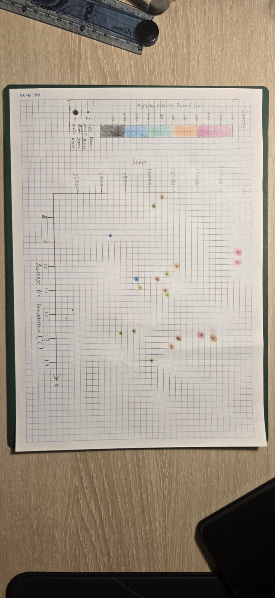
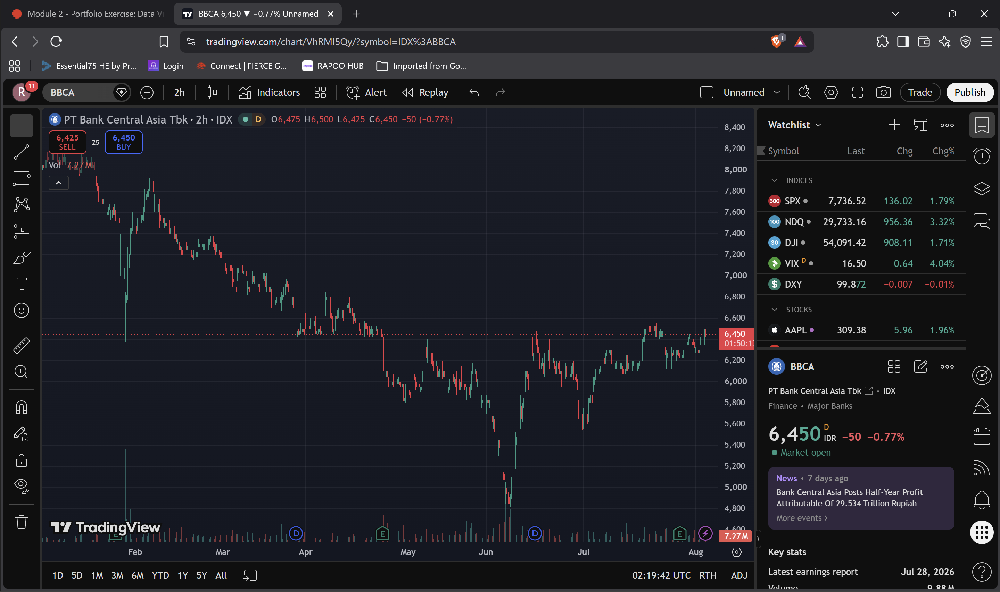
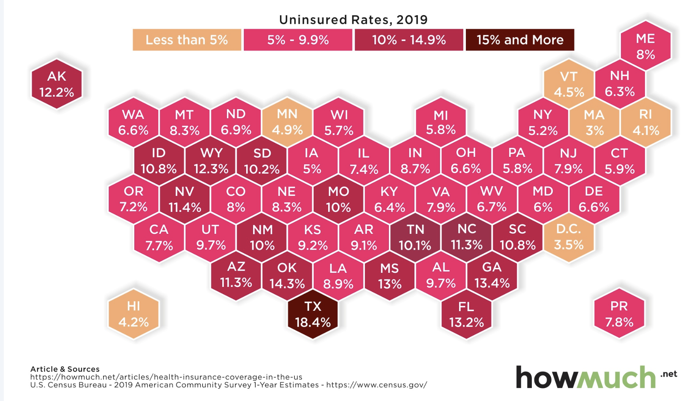
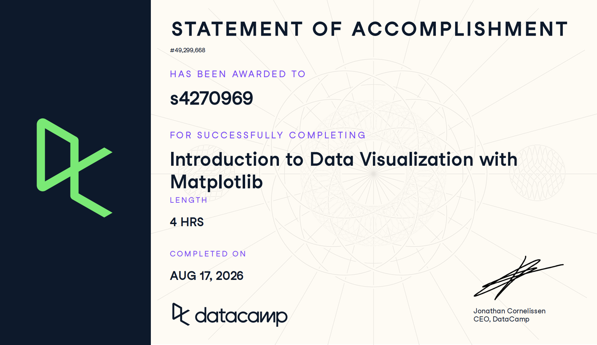

# Bundle 1

### Table of Contents
* [Bundle 1](#bundle-1)
  * [Go to Part I: Steps vs. Average Air Temperature](#part-i-steps-vs-average-air-temperature)
  * [Go to Part II: Web Data Visualisation Analysis (PT Bank Central Asia Tbk)](#part-ii-web-data-visualisation-analysis-pt-bank-central-asia-tbk)
* [Bundle 2](#bundle-2)
  * [Go to Part III: Data Verification Audit (HowMuch.net)](#part-iii-data-verification-audit-howmuchnet-(28/08/26))
  * [Go to Part IV: Tools of the Trade (Technical Skills & Certification)](#part-iv-tools-of-the-trade-technical-skills--certification)

---

## Part I: Steps vs. Average Air Temperature

### Data Visualization

*Figure 1*  
*Graph Showing Steps Against Average Air Temperature*

---
##### Note: Due to my mistake, I forgot to document the stages of creating the data visualization, but I can assure you that this was all done by my hands 
### Project Overview

What I made here is a chart featuring multiple variables such as steps, average air temperature, active calories burned, and distance while active. I gathered the data from my Samsung Health app which tracked down the health metrics that I plotted down in the graph. For the average air temperature I took the lowest and the Highest temperatures from a dataset from the Australian Bureau of Meteorology’s website, and found the average using that (Bureau of Meteorology, 2026). I tried incorporating multiple different variables into the graph and Figure 1 is what I ended up with. The main thing I wanted to show was the correlation between the average air temperature and the amount of steps I was taking. The second thing I wanted to show was the amount of active calories burned in a day, since I was limited to only two dimensions, I had to get creative and show it using a distinct color scale. Lastly, I tried showing the distance while active through size, but I did not really execute it really well since size scaling is really hard to do accurately using a pencil and paper. Another thing I could have added in was the metric of whether it was a weekday or not by changing the shapes since I have the dates of each points, but I felt like it was a bit too much for me to do. My future goals is to maybe do this digitally and have the correct means to have size scaling and maybe adding more variables.

---

### References

Bureau of Meteorology. (2026). *Melbourne, Victoria daily weather observations* [Data set]. Table 1 Column Temps Min Max. Australian Government. https://www.bom.gov.au/climate/dwo/202607/html/IDCJDW3050.202607.shtml

---

## Part II: Web Data Visualisation Analysis (PT Bank Central Asia Tbk)

### Data Visualization

*Figure 1*  
*PT Bank Central Asia Tbk (BBCA) 6-Month Candlestick Price and Volume Chart (2 Hour Interval)*  
*Note.* Adapted from *PT Bank Central Asia Tbk Stock Price and Chart (IDX:BBCA)*, by TradingView, 2026, TradingView (https://www.tradingview.com/chart/VhRMI5Qy/?symbol=IDX%3ABBCA). Copyright 2026 by TradingView.

---

### Exercise Objective

The main goal of this portfolio exercise is to see and analyze a data visualization on the internet by analyzing its visual design elements and how it is perceived by humans. By paying attention to the features like the preattentive processing, gestalt principles, and visual comparison accuracy, we are able to see how the data visualization grabs our attention and how we read it. 

---

### Analysis Responses

#### 1. Preattentive Processing
The feature that caught my eyes were the sharp dip in the candlestick line at around June and how the colors signify the drop and rise of the stock price. The attributes that help them pop out are the positions of the candlesticks in the Y-axis, the orientation/angle ( the steep downwards and upwards angle), and the color hue (red vs green) (Baglin, 2026). All these attributes work together to grab my attention making it one of the most prominent parts of the chart and showing that there was a significant drop in price by the red line going down, and that there was a correction in price. It tells a story for the audience without needing the audience to read the labels to see that there was something going on there (Baglin, 2026).

#### 2. Gestalt Principles
The data visualization primarily shows the law of continuity as we perceive the 2 hour individual candlesticks as one continuous line (Cherry, 2026). There also some other gestalts law in this chart such as law of proximity allowing us to correlate which candlesticks correlate with which month, law of similarity showing us that candlesticks with the same color means the same thing where green means a rise and red means a drop, and also the law of common region, making it so that we perceive the candlestick chart as it’s own thing, and the two boxes on top as separate things from the chart even if they occupy the same space (Cherry, 2026).

#### 3. Visual Comparison Accuracy
One of the quantitative variable visualised is the stock price, measured in IDR, which is represented by the vertical placement of the candlesticks along the Y-axis. Position along a common scale sit on the top of Cleveland and McGill’s hierarchy of perceptual tasks (Baglin, 2026). Because the price points share the same vertical scale and baseline, the viewers are able to compare the values of the price points with accuracy. However, because this chart spans across 6 months, the y axis has to stretch due to the significant price drops making the Y-axis scale stretches and the candlesticks become thinner, which might make it harder for some viewer to accurately pinpoint the price without zooming in or using the interactive crosshair.

---

### References

Baglin, J. (2026, March 26). *Data visualisation: From theory to practice*. STEM Data Visualisation. https://data-visualisation.stem.melbourne/visual-perception-and-colour.html#preattentive-processing

Cherry, K. (2026, March 2). *What are the Gestalt principles?* Verywell Mind. https://www.verywellmind.com/gestalt-laws-of-perceptual-organization-2795835

TradingView. (2026). *PT Bank Central Asia Tbk stock price and chart* [Financial chart]. Retrieved August 5, 2026, from https://www.tradingview.com/chart/VhRMI5Qy/?symbol=IDX%3ABBCA

---

# Bundle 2

## Part III: Data Verification Audit (HowMuch.net) (28/08/26)

### Data Visualization

*Figure 1*  
*Hexagonal cartogram map of uninsured rates across U.S. states. Adapted from Mapped: Uninsured Rates by State, by HowMuch.net, 2021.*

---

### Exercise Objective

The objective of this portfolio exercise is to audit a published web data visualization for data integrity, trace reported figures back to their primary source of origin, analyze the visual encoding and level of measurement of each variable, assess the alignment between the underlying question and data, and critically evaluate the limitations of the source data.

---

### Data Analysis and Verification

#### 1. Types of Variables and Levels of Measurement
* **Geographic entity (U.S. States):** Represented using hexagons arranged in the shape of the U.S., where each border defines a geographical boundary. The unit is the state name, and the level of measurement is Nominal.
* **Uninsured Rate (Percentage):** Represented by numerical labels. The unit is the percentage of the uninsured population (%), and the level of measurement is Ratio (a continuous numeric scale with an absolute zero).
* **Color Hue & Shading (Choropleth Scale):** Represented by the fill color of each hexagon. The unit is visual gradient intensity, and the level of measurement is Ordinal.

#### 2. Alignment of Data and Question
* **Data (D):** State-level percentages of civilian non-institutionalized residents without health insurance from the 2019 ACS 1-Year Estimates (U.S. Census Bureau, 2020).
* **Core Question (Q):** How does health insurance coverage vary geographically across the United States, and which states exhibit the highest and lowest rates of uninsured residents?
* **Alignment:** Evaluated using the Junk Charts Trifecta Checkup (Fung, 2014), there is strong alignment between the core question and the data. Measuring uninsured population proportions by state directly resolves geographic disparity questions.

#### 3. Data Verification
* **Verification Findings:** The verification results are recorded in Comparison.xlsx. The figures visualized by HowMuch.net (2021) match the official U.S. Census Bureau (2020) ACS Table S2701 dataset with zero discrepancies.
* **Confidence:** Confidence in data accuracy is high. However, a potential point of confusion exists: HowMuch.net published the graphic in 2021 using 2019 pre-pandemic data. Without the year specified in the title, readers might assume the graphic reflects contemporary 2021 pandemic-era rates.

#### 4. Data Source Examination
The primary dataset from the U.S. Census Bureau (2020) is authoritative and reputable. However, because the American Community Survey relies on probability sampling rather than a total population count, each estimate carries a reported margin of error (e.g., ±0.2% for Texas, ±1.3% for Wyoming).

---

### References

Fung, K. (2014, May 26). *Junk Charts Trifecta Checkup: The definitive guide*. Junk Charts. https://www.junkcharts.com/junk-charts-trifecta-checkup-the-definitive-guide/

HowMuch.net. (2021, March 30). *Mapped: Uninsured rates by state*. HowMuch.net. https://howmuch.net/articles/health-insurance-coverage-in-the-us

U.S. Census Bureau. (2020). *Selected characteristics of health insurance coverage in the United States: 2019 American Community Survey 1-year estimates (Table S2701)*. U.S. Department of Commerce. https://data.census.gov/table?q=S2701&g=010XX00US$0400000&y=2019

---

## Part IV: Tools of the Trade (Technical Skills & Certification)

### Exercise Objective

The objective of this section is to document my technical skill set, proficiency levels, and professional tool stack across data analytics, software engineering, and data visualization[cite: 1]. It reflects both structured academic and professional training, highlighting practical application across industry internships, research projects, and university coursework[cite: 1].

---

### Technical Skills & Competency Matrix

| Category | Skill / Tool | Specific Capabilities & Applied Experience | Proficiency Level | Evidence & Application Context |
| :--- | :--- | :--- | :--- | :--- |
| **Data Analytics & ML** | **Python (Prophet, XGBoost, NumPy)** | Time-series sales forecasting, predictive booking models, structured feature analysis, and data preprocessing[cite: 1] | Experienced | Data Analyst Intern at PT Mandiri Utama Finance[cite: 1]; ICISS 2025 Lung Cancer Prediction Research[cite: 1]; DataCamp Introduction to Python |
| **Data Visualization** | **Matplotlib & Seaborn** | Custom line charts, time-series plotting, distribution visualisations, subplot structuring, and visual formatting | Experienced | ICISS 2025 feature analysis[cite: 1]; DataCamp Introduction to Data Visualization with Matplotlib |
| **Business Intelligence** | **Power BI & Microsoft Fabric** | High-traffic executive dashboard optimization, mobile-responsive layouts, custom table-driven tracking, and Fabric storage integration[cite: 1] | Experienced | Executive dashboards deployed during PT Mandiri Utama Finance internship[cite: 1] |
| **Database & Engineering** | **SQL (T-SQL, Oracle SQL)** | Stored procedure optimization, legacy script refactoring, database querying, relational schema mapping[cite: 1] | Experienced | Data Warehousing & MIS ETL workflows at PT Mandiri Utama Finance[cite: 1] |
| **ETL & Orchestration** | **Apache NiFi & Apache Airflow** | Automated ETL pipeline deployment, scheduled workflow orchestration, and enterprise CRM data ingestion[cite: 1] | Developing | Data engineering pipeline automation at PT Mandiri Utama Finance[cite: 1] |
| **Programming** | **Java & C++** | Object-oriented programming, algorithmic implementation, and fundamental data structure design[cite: 1] | Experienced | Foundational Computer Science & Software Engineering coursework (BINUS / RMIT)[cite: 1] |
| **Hardware & IoT** | **ESP32 & Arduino** | Microcontroller programming, multi-sensor integration, hardware-software interfacing, and prototyping[cite: 1] | Experienced | Smart Environmental Protection System (Team Lead & Developer)[cite: 1] |
| **Version Control** | **Git & GitHub** | Collaborative branch management, source code tracking, commit hygiene, and repository maintenance[cite: 1] | Experienced | Academic software projects and GitHub repositories[cite: 1] |
| **Data Auditing & Design** | **Visual Perception & Verification** | Junk Charts Trifecta Checkup, Cleveland & McGill visual hierarchy, Gestalt perceptual principles, margin of error analysis | Experienced | [Part II: BBCA Candlestick Analysis](#part-ii-web-data-visualisation-analysis-pt-bank-central-asia-tbk); [Part III: HowMuch.net Audit](#part-iii-data-verification-audit-howmuchnet) |

---

### Certifications & Accreditations

#### 1. Introduction to Python (DataCamp)
* **Issuing Organization:** DataCamp
* **Topics Covered:** Python data structures (lists, dictionaries), functions, package management, and numerical computing with NumPy.
* **Certificate:**

*Figure 1*  
*Certificate of Completion: Introduction to Python (DataCamp)*

#### 2. Introduction to Data Visualization with Matplotlib (DataCamp)
* **Issuing Organization:** DataCamp
* **Topics Covered:** Quantitative data plotting, time-series visual styling, comparative categorical plots, statistical annotations, and automated figure export.
* **Certificate:**

*Figure 2*  
*Certificate of Completion: Introduction to Data Visualization with Matplotlib (DataCamp)*

---

### References

DataCamp. (2026). *Introduction to Python* [Online course]. https://www.datacamp.com/courses/intro-to-python-for-data-science

DataCamp. (2026). *Introduction to Data Visualization with Matplotlib* [Online course]. https://www.datacamp.com/courses/introduction-to-data-visualization-with-matplotlib
