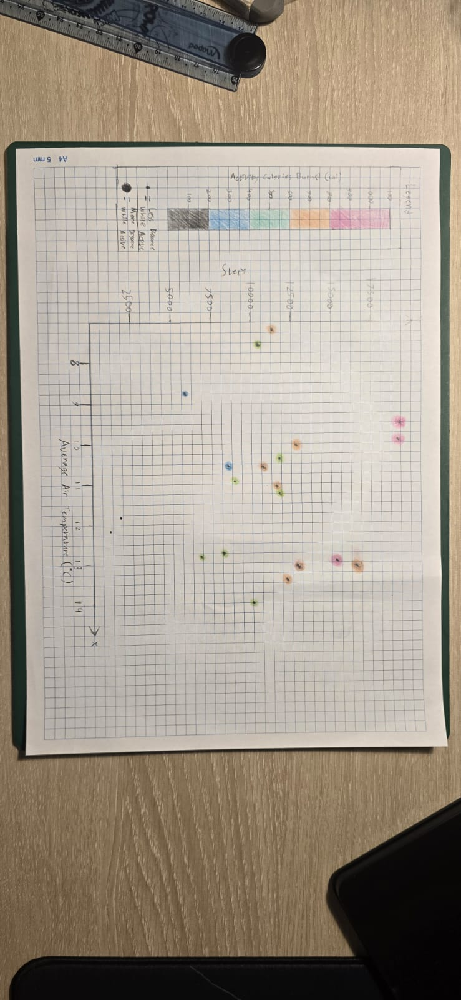
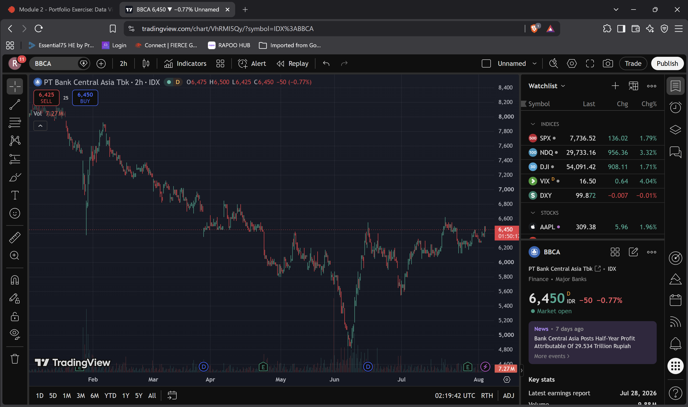
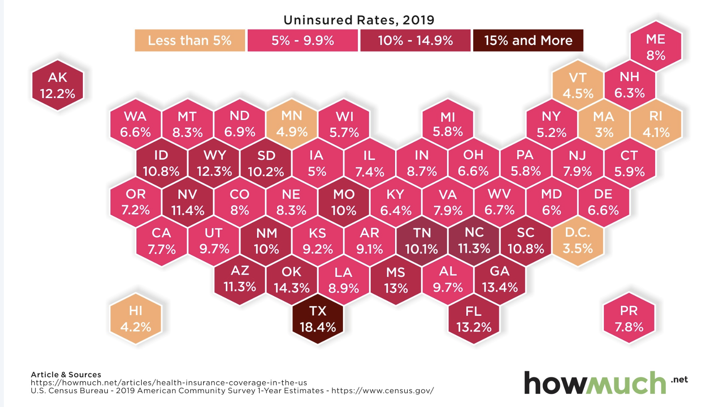
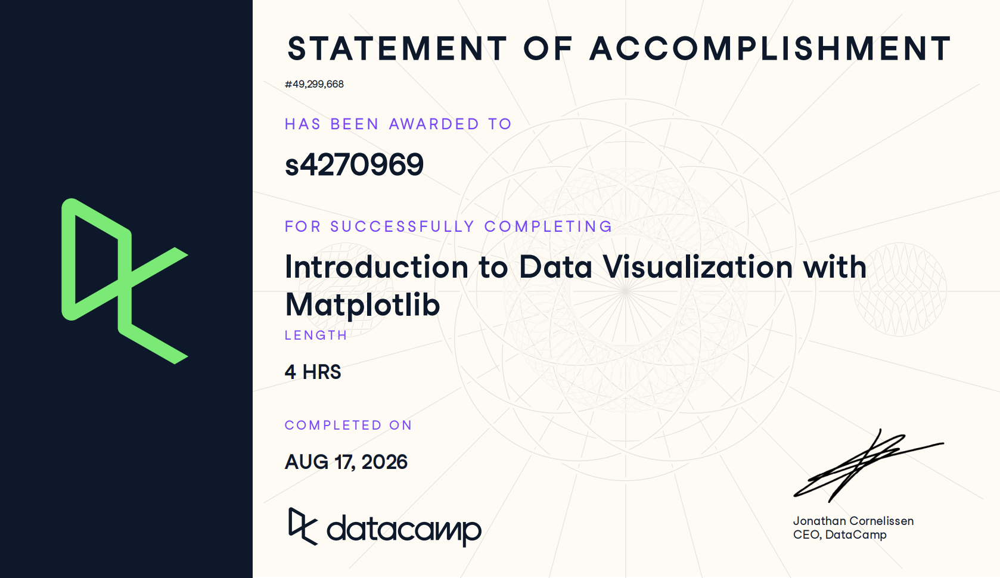
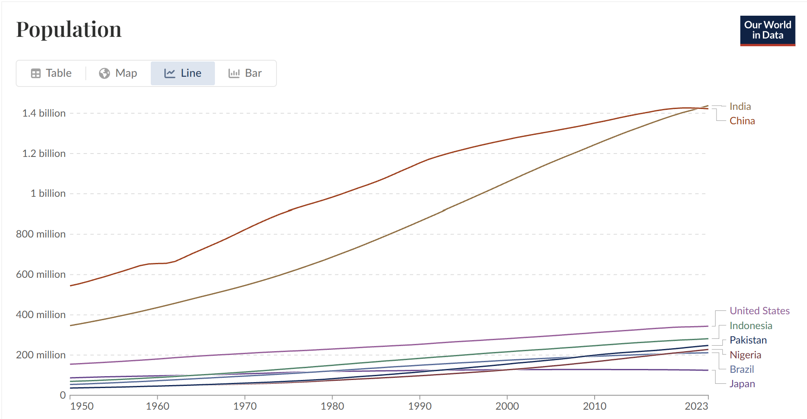
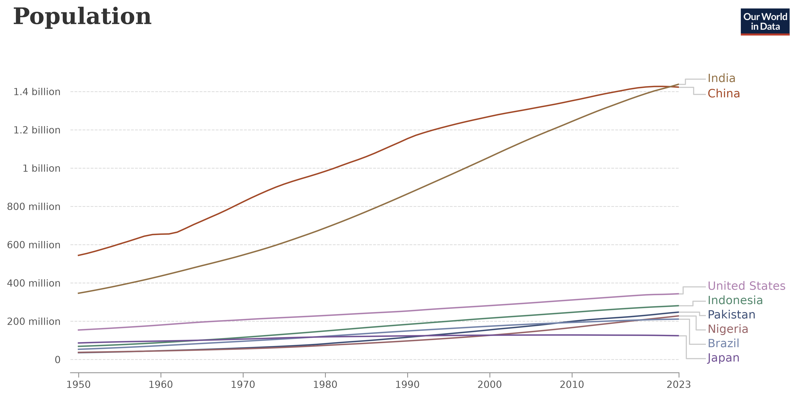
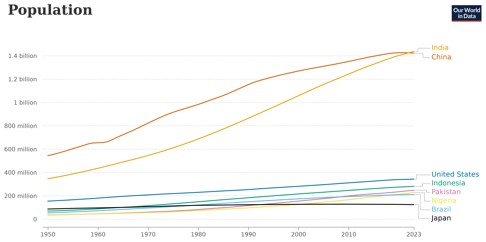
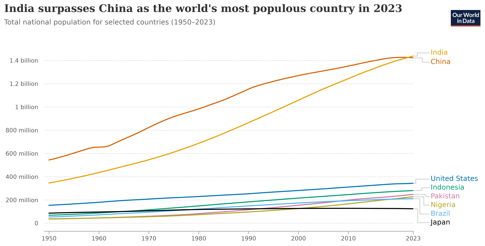
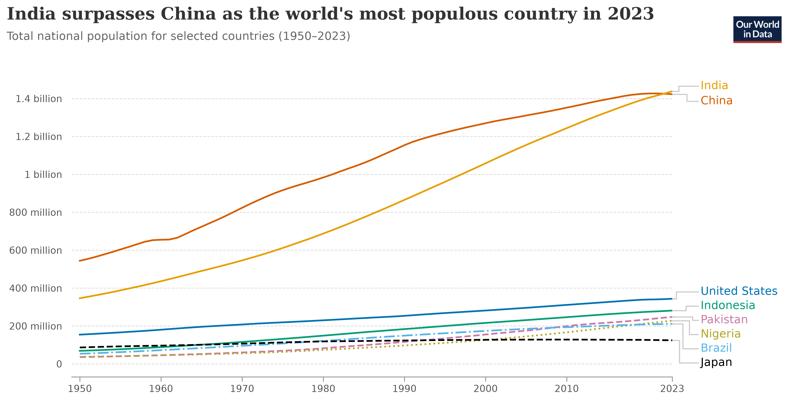
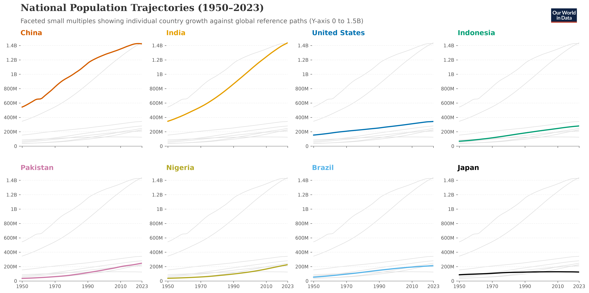

### Table of Contents
* [Bundle 1.1]
  * [Go to Part I: Steps vs. Average Air Temperature](#part-i-steps-vs-average-air-temperature)
  * [Go to Part II: Web Data Visualisation Analysis (PT Bank Central Asia Tbk)](#part-ii-web-data-visualisation-analysis-pt-bank-central-asia-tbk)
* [Bundle 1.2]
  * [Go to Part III: Data Verification Audit (HowMuch.net)](#part-iii-data-verification-audit-howmuchnet-280826)
  * [Go to Part IV: Tools of the Trade (Technical Skills & Certification)](#part-iv-tools-of-the-trade-technical-skills--certification)
* [Bundle 2.1]
  * [Go to Part VI: Checked and accessible! (Our World in Data) (08/09/26)](#part-vi-checked-and-accessible-our-world-in-data-080926)
  * [Go to Part VII: Make it multivariate! (Australian Bureau of Statistics) (02/10/26)](#part-vii-make-it-multivariate-australian-bureau-of-statistics-021026)
  * [Go to Part VIII: Map it! (Our World in Data & World Bank) (02/10/26)](#part-viii-map-it-our-world-in-data--world-bank-021026)
---

# Part 1

---

# Bundle 1

---
## Part I: Steps vs. Average Air Temperature

### Data Visualization

*Figure 1*  
*Graph Showing Steps Against Average Air Temperature*

---
##### Note: Due to my mistake, I forgot to document the stages of creating the data visualization, but I can assure you that this was all done by my hands 
### Project Overview

What I made here is a chart featuring multiple variables such as steps, average air temperature, active calories burned, and distance while active. I gathered the data from my Samsung Health app which tracked down the health metrics that I plotted down in the graph. For the average air temperature I took the lowest and the Highest temperatures from a dataset from the Australian Bureau of Meteorology’s website, and found the average using that (Bureau of Meteorology, 2026). I tried incorporating multiple different variables into the graph and Figure 1 is what I ended up with. The main thing I wanted to show was the correlation between the average air temperature and the amount of steps I was taking. The second thing I wanted to show was the amount of active calories burned in a day, since I was limited to only two dimensions, I had to get creative and show it using a distinct color scale. Lastly, I tried showing the distance while active through size, but I did not really execute it really well since size scaling is really hard to do accurately using a pencil and paper. Another thing I could have added in was the metric of whether it was a weekday or not by changing the shapes since I have the dates of each points, but I felt like it was a bit too much for me to do. My future goals is to maybe do this digitally and have the correct means to have size scaling and maybe adding more variables.

---

### References

Bureau of Meteorology. (2026). *Melbourne, Victoria daily weather observations* [Data set]. Table 1 Column Temps Min Max. Australian Government. https://www.bom.gov.au/climate/dwo/202607/html/IDCJDW3050.202607.shtml

---

## Part II: Web Data Visualisation Analysis (PT Bank Central Asia Tbk)

### Data Visualization

*Figure 1*  
*PT Bank Central Asia Tbk (BBCA) 6-Month Candlestick Price and Volume Chart (2 Hour Interval)*  
*Note.* Adapted from *PT Bank Central Asia Tbk Stock Price and Chart (IDX:BBCA)*, by TradingView, 2026, TradingView (https://www.tradingview.com/chart/VhRMI5Qy/?symbol=IDX%3ABBCA). Copyright 2026 by TradingView.

---

### Exercise Objective

The main goal of this portfolio exercise is to see and analyze a data visualization on the internet by analyzing its visual design elements and how it is perceived by humans. By paying attention to the features like the preattentive processing, gestalt principles, and visual comparison accuracy, we are able to see how the data visualization grabs our attention and how we read it. 

---

### Analysis Responses

#### 1. Preattentive Processing
The feature that caught my eyes were the sharp dip in the candlestick line at around June and how the colors signify the drop and rise of the stock price. The attributes that help them pop out are the positions of the candlesticks in the Y-axis, the orientation/angle ( the steep downwards and upwards angle), and the color hue (red vs green) (Baglin, 2026). All these attributes work together to grab my attention making it one of the most prominent parts of the chart and showing that there was a significant drop in price by the red line going down, and that there was a correction in price. It tells a story for the audience without needing the audience to read the labels to see that there was something going on there (Baglin, 2026).

#### 2. Gestalt Principles
The data visualization primarily shows the law of continuity as we perceive the 2 hour individual candlesticks as one continuous line (Cherry, 2026). There also some other gestalts law in this chart such as law of proximity allowing us to correlate which candlesticks correlate with which month, law of similarity showing us that candlesticks with the same color means the same thing where green means a rise and red means a drop, and also the law of common region, making it so that we perceive the candlestick chart as it’s own thing, and the two boxes on top as separate things from the chart even if they occupy the same space (Cherry, 2026).

#### 3. Visual Comparison Accuracy
One of the quantitative variable visualised is the stock price, measured in IDR, which is represented by the vertical placement of the candlesticks along the Y-axis. Position along a common scale sit on the top of Cleveland and McGill’s hierarchy of perceptual tasks (Baglin, 2026). Because the price points share the same vertical scale and baseline, the viewers are able to compare the values of the price points with accuracy. However, because this chart spans across 6 months, the y axis has to stretch due to the significant price drops making the Y-axis scale stretches and the candlesticks become thinner, which might make it harder for some viewer to accurately pinpoint the price without zooming in or using the interactive crosshair.

---

### References

Baglin, J. (2026, March 26). *Data visualisation: From theory to practice*. STEM Data Visualisation. https://data-visualisation.stem.melbourne/visual-perception-and-colour.html#preattentive-processing

Cherry, K. (2026, March 2). *What are the Gestalt principles?* Verywell Mind. https://www.verywellmind.com/gestalt-laws-of-perceptual-organization-2795835

TradingView. (2026). *PT Bank Central Asia Tbk stock price and chart* [Financial chart]. Retrieved August 5, 2026, from https://www.tradingview.com/chart/VhRMI5Qy/?symbol=IDX%3ABBCA

---

# Bundle 2

## Part III: Data Verification Audit (HowMuch.net) (28/08/26)

### Data Visualization

*Figure 1*  
*Hexagonal cartogram map of uninsured rates across U.S. states. Adapted from Mapped: Uninsured Rates by State, by HowMuch.net, 2021.*

---

### Exercise Objective

The objective of this exercise is to take a look at a published data visualization and verify if it is correct and appropriate. I have to trace their primary source and analyze the visualization and visual encoding to see if there are any discrepancies and if there is an alignment between the core question and data.

---

### Data Analysis and Verification

#### 1. Types of Variables and Levels of Measurement
* **Geographic entity (U.S. States):** It is represented using hexagons that are laid out in a rough shape of the U.S. where each hexagon border represents geographical boundary. The unit is the state name, and the level of measurement is Nominal.
* **Uninsured Rate (Percentage):** It is represented by numerical labels. The unit is the percentage of uninsured population (%), and level of measurement is Ratio (continuous numeric scale with a true zero).
* **Color Hue & Shading (Choropleth Scale):**  Represented by the fill color of the hexagons. The unit is the visual gradient intensity and the level of measurement is Ordinal.

#### 2. Alignment of Data and Question
* **Data (D):** State level percentages of civilian non-institutionalized residents without insurance from the ACS 1-Year Estimates (U.S. Census Bureau, 2020).
* **Core Question (Q):** How does health insurance coverage vary geographically across the United States, and which states exhibit the highest/lowest rates of uninsured residents?
* **Alignment:** Using the Junk Charts Trifecta Checkup framework (Fung, 2014), there is strong alignment between the core question and the data provided (HowMuch.net, 2021).  Measuring the uninsured percentage by state answers the question of the differences between states.

#### 3. Data Verification
* **Verification Findings:** I placed my data verification results in Comparison.xlsx, and from what I see, all the data visualized from HowMuch.net matches exactly with the data from the official U.S. Census Bureau (2020) ACS Table S2701 dataset exactly. There were no errors found.
* **Confidence:** I am very confident with the data that HowMuch.net (2021) used is accurate, but there is one tiny thing that might mislead the readers. The article and visualization was published in 2021, but the data that HowMuch.net uses is from 2019, so some readers might be mislead and think that they used 2021 data if read carelessly as the article title didn’t say anything about the year.

#### 4. Data Source Examination
-	The primary data source used by HowMuch.net (2021) is highly reputable, as it is published by the U.S. Census Bureau (2020).Even if the data source is reputable, there are also limitations to the data provided. Since the American Community Survey is done using a sample instead of census, each percentage has a margin of error. 

---

### References

Fung, K. (2014, May 26). *Junk Charts Trifecta Checkup: The definitive guide*. Junk Charts. https://www.junkcharts.com/junk-charts-trifecta-checkup-the-definitive-guide/

HowMuch.net. (2021, March 30). *Mapped: Uninsured rates by state*. HowMuch.net. https://howmuch.net/articles/health-insurance-coverage-in-the-us

U.S. Census Bureau. (2020). *Selected characteristics of health insurance coverage in the United States: 2019 American Community Survey 1-year estimates (Table S2701)*. U.S. Department of Commerce. https://data.census.gov/table?q=S2701&g=010XX00US$0400000&y=2019

---

## Part IV: Tools of the Trade (Technical Skills & Certification)

### Exercise Objective

The objective of this section is to show my technical skill set and how proficient I am. It shows where I gained the skills and how I applied it.

---

### Technical Skills & Competency Matrix

| Category | Skill / Tool | Specific Capabilities & Applied Experience | Proficiency Level | Evidence & Application Context |
| :--- | :--- | :--- | :--- | :--- |
| **Data Analytics & ML** | **Python (Prophet, XGBoost, NumPy)** | Time-series sales forecasting, predictive booking models, structured feature analysis, and data preprocessing | Developing | Data Analyst Intern at PT Mandiri Utama Finance; ICISS 2025 Lung Cancer Prediction Research; DataCamp Introduction to Python |
| **Data Visualization** | **Matplotlib & Seaborn** | Custom line charts, time-series plotting, distribution visualisations, subplot structuring, and visual formatting | Developing | ICISS 2025 feature analysis; DataCamp Introduction to Data Visualization with Matplotlib |
| **Business Intelligence** | **Power BI & Microsoft Fabric** | High-traffic executive dashboard optimization, mobile-responsive layouts, custom table-driven tracking, and Fabric storage integration | Developing | Executive dashboards deployed during PT Mandiri Utama Finance internship |
| **Database & Engineering** | **SQL (T-SQL, Oracle SQL)** | Stored procedure optimization, legacy script refactoring, database querying, relational schema mapping | Developing | Data Warehousing & MIS ETL workflows at PT Mandiri Utama Finance |
| **ETL & Orchestration** | **Apache NiFi & Apache Airflow** | Automated ETL pipeline deployment, scheduled workflow orchestration, and enterprise CRM data ingestion | Developing | Data engineering pipeline automation at PT Mandiri Utama Finance |
| **Programming** | **Java & C++** | Object-oriented programming, algorithmic implementation, and fundamental data structure design | Developing | Foundational Computer Science & Software Engineering coursework (BINUS / RMIT) |
| **Hardware & IoT** | **ESP32 & Arduino** | Microcontroller programming, multi-sensor integration, hardware-software interfacing, and prototyping | Developing | Smart Environmental Protection System (Team Lead & Developer) |
| **Version Control** | **Git & GitHub** | Collaborative branch management, source code tracking, commit hygiene, and repository maintenance | Developing | Academic software projects and GitHub repositories |
| **Data Auditing & Design** | **Visual Perception & Verification** | Junk Charts Trifecta Checkup, Cleveland & McGill visual hierarchy, Gestalt perceptual principles, margin of error analysis | Developing | [Part II: BBCA Candlestick Analysis](#part-ii-web-data-visualisation-analysis-pt-bank-central-asia-tbk); [Part III: HowMuch.net Audit](#part-iii-data-verification-audit-howmuchnet-280826) |

---

### Certifications & Accreditations

#### 1. Introduction to Python (DataCamp)
* **Issuing Organization:** DataCamp
* **Topics Covered:** Python data structures (lists, dictionaries), functions, package management, and numerical computing with NumPy.
* **Certificate:**

*Figure 1*  
*Certificate of Completion: Introduction to Python (DataCamp)*

#### 2. Introduction to Data Visualization with Matplotlib (DataCamp)
* **Issuing Organization:** DataCamp
* **Topics Covered:** Quantitative data plotting, time-series visual styling, comparative categorical plots, statistical annotations, and automated figure export.
* **Certificate:**

*Figure 2*  
*Certificate of Completion: Introduction to Data Visualization with Matplotlib (DataCamp)*

---

### References

DataCamp. (2026). *Introduction to Python* [Online course]. https://www.datacamp.com/courses/intro-to-python-for-data-science

DataCamp. (2026). *Introduction to Data Visualization with Matplotlib* [Online course]. https://www.datacamp.com/courses/introduction-to-data-visualization-with-matplotlib

---

## Part V: Data Visualisation Reproduction & Reconstruction (Our World in Data) (28/08/26)

### Exercise Objective

The objective of this exercise is to dive in and start recreating data visualization using a tool (python). The main objective is to try to recreate a data visualization as close as possible by using the original data and the same colors as the original. After that, we need to make the same recreation using a different appropriate color palette.

---

### Master Data Visualization

*Figure 1*  
*Master Data Visualization: Population Growth for Selected Countries (1950–2023). Sourced from Our World in Data (2024).*

---

### Replications & Visual Outputs

#### 1. Original Recreation

*Figure 2*  
*Replicated Visualization matching the layout, typography, and original categorical colour palette of Our World in Data using data from Our World in Data (2024).*

#### Methodology & Step-by-Step Process
How I recreated the visualization was first using data from Our World in Data (2024) and filtering out the years so that it only takes the data from 1950 until 2023, and only using the 8 selected countries. After that, I had to start formatting the Y axis and X axis so that it shows the same way that the original did. And after that, it was on to the process of adding in the tiny little details like the brackets that connected the lines from the plotted lines, and the country name. For the color palette of the recreation, I went on Figma to use their color picker and tried my best to get the same color as the original. 

A problem I faced when making the recreation is that there was a lot of trial and error for the placement of the bracket points and I had to look up how to make it so that the country labels didn’t clip together. There was quite a bit of trial and error in recreating the original visualization. Another problem I faced was that I can’t really get the font style and styling just right for the title, so there are some differences in that area. I also couldn’t add the interactivity and I did not add the choice bar up top that the original had because I haven’t learned the skill yet and it can be a future goal for me. I also added the logo of Our World in Data in the top right corner as well to make it seem much more similar to the original.

---

#### 2. Reconstruction with an Alternative (Accessible) Colour Scale

*Figure 3*  
*Reconstructed Visualization utilizing the accessible Okabe-Ito colour scale (Siegal Lab, n.d.).*

#### Explanation of Colour Scale Development
I was tasked with using an alternate color palette for the visualization and I wanted to use something that is accessible to color blind people. I did my own research and landed on the Okabe-Ito color palette (Siegal Lab, n.d.). It was a color palette I liked, because it still had really distinct colors while still accommodating for color blind people. 

There is a problem with the palette though. The color used for Nigeria is part of the palette, but it does not really contrast well with a white background. In the future, I would like to do a bit more research and see if I can fix this by either changing it to another accessible color, or maybe changing the background color so that it contrasts better.

---

### Data Card

| Section | Details |
| :--- | :--- |
| **Title** | Population Growth by Country (1950–2023) |
| **Summary** | A multi-line time series visualization showing total national population trends from 1950 to 2023 for eight different countries: China, India, United States, Indonesia, Pakistan, Nigeria, Brazil, and Japan. |
| **Data Sources** | Primary Source / Host: Our World in Data. (2024). *Population and Demography Data Explorer* [Data set]. https://ourworldindata.org/explorers/population-and-demography?indicator=Population&Sex=Both+sexes&Age=Total&Projection+scenario=None&country=CHN~IND~USA~IDN~PAK~NGA~BRA~JPN   Original Source: United Nations, Department of Economic and Social Affairs, Population Division. (2024). *World Population Prospects 2024, Online Edition* [Data set]. United Nations. https://population.un.org/wpp/ |
| **Mapping** | X axis: Year, it is a continuous annual time steps from 1950 to 2023 (UN DESA / OWID, 2024).  Y axis: Total Population (both sexes, all ages) — measured in counts (headcount), formatted into millions and billions (e.g., 200 million, 1.4 billion) (UN DESA / OWID, 2024). |
| **Important Notes** | Preprocessing and Filtering: The full source dataset has global historical and projected population figures across hundreds of different countries. The data was filtered exclusively for the years 1950 to 2023 and filtered to the 8 specified countries. The table was pivoted so each country forms an individual time series column.  Missing Data: No missing values were present for the selected 8 countries over the 1950–2023 period. |
| **Access** | Direct page access to download data: [Our World in Data Population Explorer Download](https://ourworldindata.org/explorers/population-and-demography?overlay=download-data&indicator=Population&Sex=Both+sexes&Age=Total&Projection+scenario=None&country=CHN~IND~USA~IDN~PAK~NGA~BRA~JPN) |

---

### Generative AI Acknowledgment

I used Gemini, an AI tool created by Google (Google, 2026), to find different methods to help me recreate the original visualization, including how to format the y-axis, how to make the brackets, how to stop overlapping of labels, and how to add an image to a plot using Python.

---

### References

Google. (2026, August 28). *Population data visualisation reproduction* [Generative AI chat]. Gemini. https://share.gemini.google/kSvBB1YkYkiL

Our World in Data. (2024). *Population, 1950 to 2023* [Data visualization and data set]. Global Change Data Lab. https://ourworldindata.org/explorers/population-and-demography?indicator=Population&Sex=Both+sexes&Age=Total&Projection+scenario=None&country=CHN~IND~USA~IDN~PAK~NGA~BRA~JPN

Siegal Lab. (n.d.). *Color palette*. Department of Biology and Center for Genomics & Systems Biology, New York University. https://siegal.bio.nyu.edu/color-palette/

United Nations, Department of Economic and Social Affairs, Population Division. (2024). *World Population Prospects 2024, Online Edition* [Data set]. United Nations. https://population.un.org/wpp/

---

# Part 2

---

# Bundle 1

---
## Part VI: Checked and accessible! (Our World in Data) (08/09/26)

### Exercise Objective

The objective of this exercise is to learn about accessibility in data visualizations and how we can implement it into our recreation from module 5. Whet we needed to do is to put our visualization into the checklist and see if it complies with the checklist. Once we are done with that, we are supposed to plan out what improvements we can make and implement it.
---
### Master Visualization and Before State

  
*Figure 1*  
*Master Data Visualization. Sourced from Our World in Data (2024).*

  
*Figure 2*  
*Before Improvements: Reconstructed Visualization using the standard Okabe-Ito colour scale (Siegal Lab, n.d.).*

---

### Summary of Planned Improvements

I put my previous recreation with accessible colors in the checklist and found two areas where I can improve the visualization:

* **Accessibility Improvement (Contrast and Dual Encoding):** For the original accessible recreation, I used the Okabe-Ito palette. While it is a colorblind safe palette, the yellow in the palette used for Nigeria does not really contrast well with the white background, so I changed it and darkened it to a high contrast gold color. Additionally, I found that the visualization would not be that accessible if it were to be printed in black and white as it would be hard to tell the lines at the bottom apart as they overlap with each other. So, I tried doing something like texturing by making some lines dashed and dotted, but according to me, when it is colored, it causes a bit more visual clutter, so I opted to make two versions.
* **Faceting:** After some feedback on the accessibility issue of the overlapping section of the visualization, I was given the suggestion to make it so that the visualization be faceted so it is easier to read and understand the visualization. Having the visualization be faceted also helps with making it so that it can be printed in black and white
* **Text Hierarchy & Titling:** The checklist says that a visualization must have a descriptive, full sentence title positioned in the upper left with a supporting subtitle beneath it (Evergreen, n.d.). The original data visualization only featured a generic title saying “Population”, which does not comply with the checklist, so I replaced it with the main story of the visualization and with a subtitle explaining the x and y axis and timeframe of the data visualization.

---

### After Improvements State

  
*Figure 3*  
*After Improvements (Solid): Visualization with active text hierarchy and contrast-adjusted accessible colors.*

  
*Figure 4*  
*After Improvements (Dual Encoded): Visualization incorporating dashed line styles to ensure legibility when printed in grayscale.*

  
*Figure 5*  
*After Improvements (Faceted Alternative): Small-multiples layout separating individual national paths to resolve lower-tier clutter.*

---

### References

Evergreen, S. (n.d.). Data visualization checklist. https://www.datavisualizationchecklist.com/

Our World in Data. (2024). *Population, 1950 to 2023* [Data visualization and data set]. Global Change Data Lab. https://ourworldindata.org/explorers/population-and-demography?indicator=Population&Sex=Both+sexes&Age=Total&Projection+scenario=None&country=CHN~IND~USA~IDN~PAK~NGA~BRA~JPN

Siegal Lab. (n.d.). *Color palette*. Department of Biology and Center for Genomics & Systems Biology, New York University. https://siegal.bio.nyu.edu/color-palette/

---

## Part VII: Make it multivariate! (Australian Bureau of Statistics) (02/10/26)

### Exercise Objective

The objective of this portfolio exercise is to transform an existing univariate or bivariate web data visualisation into an accessible, publication-ready multivariate visualisation displaying at least three or more meaningful variables. Using mortality data sourced from the Australian Bureau of Statistics (ABS), I extended a basic temporal line chart into a 5-dimensional multivariate dashboard that incorporates temporal trends, mortality rates, biological sex, geographic jurisdiction, and total incident volume.

---

### Step-by-Step Exercise Summary

1. **Folder Setup & Project Architecture:** Created the dedicated directory `Module 7 - Portfolio Exercise` within my OneDrive workspace to store project notes, datasets, Python scripts, exported figures, and data cards.
2. **Visualisation Sourcing & Reference:** Sourced an official line chart from the Australian Bureau of Statistics (ABS) showing crude death rates for assault across Australia from 2015 to 2024 broken down by sex and persons.
3. **Variable Selection & Dimension Design:** Identified additional dimensions within the ABS Causes of Death release to add depth to the original chart. I selected five variables:
   * **Year of Registration (2015–2024):** Temporal dimension.
   * **Crude Death Rate (per 100,000 population):** Continuous quantitative rate.
   * **Sex (Males vs. Females):** Categorical nominal.
   * **Jurisdiction / State (NSW, VIC, QLD, WA):** Spatial categorical.
   * **Total Deaths (Incident Volume):** Discrete quantitative count.
4. **Data Wrangling & Pipeline Preparation:** Using Python (`pandas`), extracted state-level and sex-disaggregated death counts and population-adjusted rates for Australia's four largest jurisdictions. Reshaped the data into tidy long format and dropped the redundant aggregate "Persons" metric to focus comparisons directly between males and females.
5. **Multivariate Visualization Build:** Implemented a 2 × 2 faceted small-multiples grid (`FacetGrid` in Seaborn/Matplotlib) separated by state to prevent overplotting. Encoded the quantitative crude rate on the common Y-axis and incident volume into proportional circle/square marker areas.
6. **Accessibility & Publication Readiness:** Applied the colorblind-safe Okabe-Ito palette (Deep Blue `#0072B2` and Vermilion `#D55E00`), accompanied by redundant dual encodings (solid lines with circular markers for males; dashed lines with square markers for females) and semi-transparent marker fills to preserve legibility in grayscale printing.

---

### Visualisations: Original vs. Re-creation

  
*Figure 1*  
*Original data visualisation from the Australian Bureau of Statistics (2025/2026) showing national crude death rates for assault by sex (2015–2024).*

  
*Figure 2*  
*Python recreation of the ABS line chart displaying crude death rates for assault by sex from 2015 to 2024.*

---

### Multivariate Data Visualisation

  
*Figure 3*  
*Multivariate faceted visualization incorporating 5 dimensions (Year, Crude Rate, Sex, Jurisdiction, and Incident Volume) using an accessible colorblind-safe palette and dual visual encodings.*

---

### Data Card

| Section | Details |
| :--- | :--- |
| **Title** | Multivariate Assault Mortality Trends Across Australian Jurisdictions (2015–2024) |
| **Summary** | A faceted time-series dashboard displaying crude assault death rates and absolute victim counts across Australia's four largest states from 2015 to 2024. Lines depict the population mortality rate, colors and marker shapes differentiate sex, small-multiple subplots isolate jurisdictions, and marker areas indicate absolute incident volume. Inspired by the baseline assault mortality line chart published by the Australian Bureau of Statistics (ABS, 2025/2026). |
| **Data Sources** | Primary Source & Host: Australian Bureau of Statistics (ABS). (2026). *Causes of death, Australia, 2024* [Data set]. Commonwealth of Australia. https://www.abs.gov.au/statistics/health/causes-death/causes-death-australia/2024#data-downloads |
| **Mapping** | * **X-Axis:** Year of Registration (continuous annual interval from 2015 to 2024). * **Y-Axis:** Crude death rate per 100,000 population (standardized across panels from 0.25 to 1.75). * **Color & Line Style (Sex):** Deep Blue (`#0072B2`) with solid lines for Males; Vermilion (`#D55E00`) with dashed lines for Females. * **Marker Shape (Sex):** Circles for Males; Squares for Females. * **Marker Area / Size:** Scaled proportionally to raw Total Deaths count (~10 to ~45+ deaths). * **Facets (Subplots):** 2 × 2 small-multiples grid partitioned by Jurisdiction (New South Wales, Victoria, Queensland, Western Australia). |
| **Important Notes** | * **Preprocessing:** Sourced ICD-10 external causes of morbidity and mortality codes X85–Y09 (Assault). Removed the aggregate "Persons" series to eliminate visual redundancy and highlight sex-based disparities. Filtered to Australia's four largest states to maintain clear visual comparison. * **Data Limitations:** Figures for recent periods (2023–2024) are preliminary and subject to ABS revision following the formal closure of coronial inquests. Crude death rates do not control for differences in state-level age distributions. |
| **Access** | Direct data download: [ABS Causes of Death 2024 Data Downloads](https://www.abs.gov.au/statistics/health/causes-death/causes-death-australia/2024#data-downloads) |

---

### References

Australian Bureau of Statistics. (2026). *Causes of death, Australia, 2024* [Data set]. Commonwealth of Australia. https://www.abs.gov.au/statistics/health/causes-death/causes-death-australia/2024#data-downloads

Australian Bureau of Statistics. (2026). *Deaths from external causes, Australia, 2024*. Commonwealth of Australia. https://www.abs.gov.au/statistics/health/causes-death/deaths-external-causes/2024

---

## Part VIII: Map it! (Our World in Data & World Bank) (02/10/26)

### Exercise Objective

The objective of this portfolio exercise is to develop a well-designed, publication-ready spatial data visualisation from web-sourced data[cite: 3]. Rather than keeping two disconnected time-slice maps that require viewers to shift back and forth to spot trends, this exercise consolidates global poverty data into a single, unified geospatial choropleth map[cite: 3]. The visualisation communicates directional shifts (reductions versus increases) in extreme poverty rates over a 10-year period across sovereign nations[cite: 3].

---

### Step-by-Step Exercise Summary

1. **Workspace Architecture:** Set up a dedicated workspace directory named `Module 8 - Portfolio Exercise` within OneDrive to manage spatial datasets, Python analysis notebooks, shapefile vector archives, and exported cartographic figures[cite: 3].
2. **Data Sourcing & Spatial Acquisition:** Sourced national headcount poverty ratios below the international poverty threshold ($3.00/day, 2017 PPP) from Our World in Data (2026) and the World Bank Poverty and Inequality Platform (World Bank, 2026)[cite: 3]. Vector shapefiles for global administrative boundaries (1:110m Admin-0 Countries) were obtained from Natural Earth (2026)[cite: 3].
3. **Data Wrangling & Delta Calculation:** In Python using `pandas`, filtered out regional aggregates (such as "World" and "Sub-Saharan Africa") and localized urban/rural partitions[cite: 3]. Extracted the baseline 2015 rate ($R_{2015}$) alongside the most recent post-2020 observation ($R_{\text{recent}}$) to calculate the net percentage-point change[cite: 3]:
   $$\Delta = R_{\text{recent}} - R_{2015}$$
   Classified the resulting rate deltas into seven symmetrical bins spanning significant decreases ($<-10\%$) to severe increases ($>+10\%$)[cite: 3].
4. **Spatial Conflation & Re-projection:** Harmonised country naming discrepancies across the tabular and spatial boundary datasets (e.g., matching "Cote d'Ivoire" to "Côte d'Ivoire" and "United States" to "United States of America")[cite: 3]. Merged the tabular indicators with the Natural Earth polygons in `geopandas` and reprojected the map coordinates from WGS84 (EPSG:4326) into the equal-area Equal Earth projection (`+proj=eqearth`) to eliminate polar landmass distortion[cite: 3].
5. **Accessibility & Cartographic Refinement:** Applied the 7-class diverging ColorBrewer BrBG (Brown–Blue/Green) palette[cite: 3]. Used teal tones to signify positive poverty reduction and brown tones to highlight worsening rates[cite: 3]. Incorporated diagonal line hatching textures across missing survey regions to distinguish unobserved territory from near-zero poverty zones, ensuring full accessibility for color-vision-deficient readers and monochrome printing[cite: 3].

---

### Visualisations: Original vs. Re-creation

  
*Figure 1*  
*Original dual-panel snapshot from Our World in Data (2026) displaying the share of population living below $3/day in 2015 versus 2025[cite: 3].*

  
*Figure 2*  
*Re-created spatial visualisation displaying the net percentage-point trajectory using the ColorBrewer BrBG diverging palette and Equal Earth projection[cite: 3].*

---

### Data Card

| Section | Details |
| :--- | :--- |
| **Title** | Global Shift in Extreme Poverty Rates (2015 vs. Latest Available)[cite: 3] |
| **Summary** | A world choropleth map showing the net percentage-point change in extreme poverty rates (living below $3.00/day at 2017 PPP) between the 2015 baseline and recent post-2020 surveys[cite: 3]. Teal tones denote poverty reduction, off-white indicates stable rates ($\pm0.5\%$), brown tones highlight worsening poverty, and diagonal gray hatched textures denote countries lacking comparable multi-period survey data[cite: 3]. Inspired by the dual-panel poverty maps on Our World in Data (2026)[cite: 3]. |
| **Data Sources** | * **Primary Host:** Our World in Data. (2026). *Poverty Data Explorer* [Data set]. Global Change Data Lab. https://ourworldindata.org/explorers/poverty-explorer[cite: 3] * **Original Source:** World Bank. (2026). *Poverty and Inequality Platform (PIP)* (Version 20260324_2021 and 20260324_2017) [Data set]. World Bank Group. https://pip.worldbank.org/[cite: 3] * **Spatial Boundary Geometry:** Natural Earth. (2026). *1:110m Cultural Vectors: Admin 0 – Countries* (Version 5.1.1) [Vector geospatial data]. https://www.naturalearthdata.com/downloads/110m-cultural-vectors/[cite: 3] |
| **Mapping** | * **Fill Color (Choropleth Polygon Fill):** Symmetrical 7-class diverging ColorBrewer BrBG color scheme mapped to net rate deltas ($\Delta = R_{\text{recent}} - R_{2015}$)[cite: 3]: &nbsp;&nbsp;&nbsp;&nbsp;• Significant Decrease ($<-10.0\%$): Dark Teal (`#01665e`)[cite: 3] &nbsp;&nbsp;&nbsp;&nbsp;• Moderate Decrease ($-10.0\%$ to $-3.0\%$): Medium Teal (`#5ab4ac`)[cite: 3] &nbsp;&nbsp;&nbsp;&nbsp;• Slight Decrease ($-3.0\%$ to $-0.5\%$): Light Teal (`#c7eae5`)[cite: 3] &nbsp;&nbsp;&nbsp;&nbsp;• Stable / Minimal Shift ($\pm0.5\%$): Center Off-White (`#f5f5f5`)[cite: 3] &nbsp;&nbsp;&nbsp;&nbsp;• Slight Increase ($+0.5\%$ to $+3.0\%$): Light Sand/Brown (`#f6e8c3`)[cite: 3] &nbsp;&nbsp;&nbsp;&nbsp;• Moderate Increase ($+3.0\%$ to $+10.0\%$): Medium Brown (`#d8b365`)[cite: 3] &nbsp;&nbsp;&nbsp;&nbsp;• Severe Increase ($>+10.0\%$): Dark Brown (`#8c510a`)[cite: 3] * **Texture / Pattern Encoding:** Dual visual encoding using light gray (`#E8E8E8`) with diagonal line hatching (`///`) designates nations without comparable survey data[cite: 3]. * **Spatial Projection:** Projected in planar Equal Earth coordinates (`+proj=eqearth`), maintaining faithful relative continent sizes without polar distortion[cite: 3]. * **Metric Unit:** Percentage-point shift ($\%$) in the share of national population living below $3.00/day (2017 PPP)[cite: 3]. |
| **Important Notes** | * **Preprocessing & Harmonization:** Removed regional summaries and urban/rural breakdowns to retain only sovereign countries[cite: 3]. Standardised country spelling variations to join tabular survey data cleanly with Natural Earth polygon geometries[cite: 3]. * **Missing Data Handling:** Nations lacking verified 2015 surveys (e.g., India) or missing post-2020 updates are given textured hatching to prevent misinterpreting missing data as zero poverty[cite: 3]. * **Analytical Limitations:** Household budget surveys are conducted in non-uniform 3-to-5-year cycles rather than annually[cite: 3]. High-income countries had already reached near-zero extreme poverty rates prior to 2015, resulting in negligible net change represented by the neutral category[cite: 3]. |
| **Access** | Direct data download: [Our World in Data Poverty Explorer Download Portal](https://ourworldindata.org/explorers/poverty-explorer?time=2015..latest&overlay=download-data)[cite: 3] |

---

### References

Natural Earth. (2026). *1:110m Cultural Vectors: Admin 0 – Countries* (Version 5.1.1) [Vector geospatial data]. https://www.naturalearthdata.com/downloads/110m-cultural-vectors/[cite: 3]

Our World in Data. (2026). *Share of population living in extreme poverty* [Data set]. Global Change Data Lab. https://ourworldindata.org/explorers/poverty-explorer[cite: 3]

World Bank. (2026). *Poverty and Inequality Platform* (Version 20260324_2021 and 20260324_2017) [Data set]. World Bank Group. https://pip.worldbank.org/[cite: 3]
